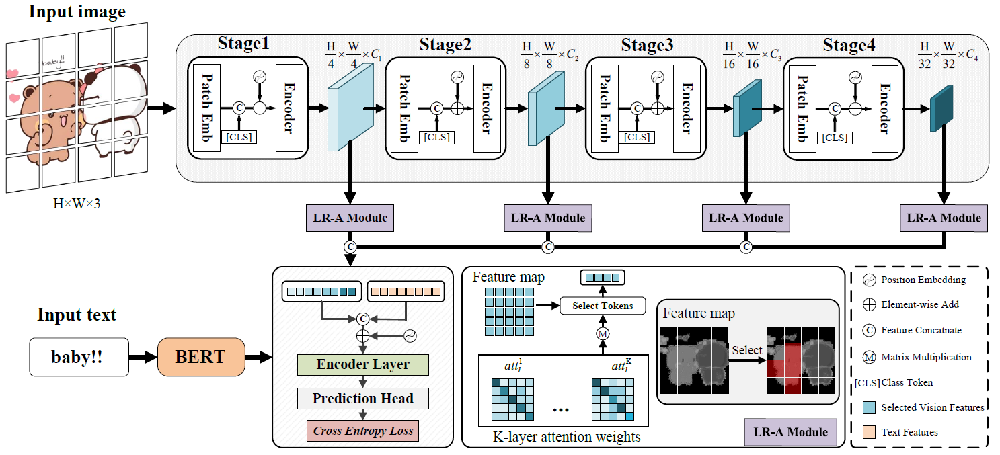

# SER30K: A Large-Scale Dataset for Sticker Emotion Recognition

SER30K dataset and pytorch training/validation code for **LOcal Re-Attention multimodal network (LORA)**.

    <h4 align="center">Overview of LOcal Re-Attention multimodal network</h4>

## SER30K dataset

Coming soon...
