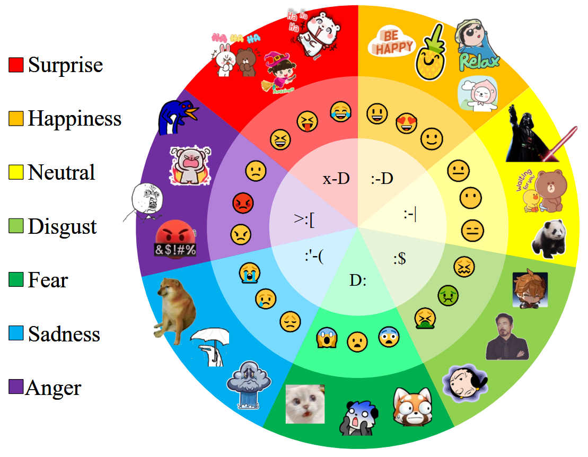

<div align="center">

## **SER30K**: A Large-Scale Dataset for Sticker Emotion Recognition

<a href="https://pytorch.org/get-started/locally/"></a>
[](https://2022.acmmm.org/)
[](https://github.com/nku-shengzheliu/SER30K/blob/main/LICENSE)

</div>

This is the official repository of our ACM Multimedia 2022 Work.
**SER30K dataset** and pytorch training/validation code for **LOcal Re-Attention multimodal network (LORA)**.

<p align="center">

    <h4 align="center">Overview of LOcal Re-Attention multimodal network (LORA)</h4>
</p>


## Abstract

With the popularity of instant messaging applications, online chatting plays an essential role in our daily life. The prevailing use of stickers to express emotions in online chatting leads to the necessity of multimodal sticker emotion recognition. Considering the lack of sticker emotion data, we collect a large-scale sticker emotion recognition dataset named SER30K. It consists of a total of 1,887 sticker themes with total 30,739 sticker images. Some commonly used images, such as realistic images and facial expression images, have been well studied in the field of emotion analysis. However, it is still challenging to understand the emotion of sticker images. Since the characteristics in stickers from the same theme are similar, we can only accurately predict the emotion by capturing the local information (e.g., expressions, poses) and understanding the global information (e.g., relations among objects). To tackle this challenge, we propose a LOcal Re-Attention multimodal network (LORA) to learn sticker emotions in an end-to-end manner. Different from previous approaches using convolutional neural networks, LORA employs the vision transformer to extract visual features, leading to better capture the global relations. In addition, we design a local re-attention module to focus on important region information. Then a simple but efficient modal fusion module combines visual and language features. Extensive experiments are performed on the SER30K and other emotion recognition datasets, demonstrating the effectiveness of our proposed method.


## SER30K dataset

If you need the SER30K dataset for academic purposes, please download the [application form](https://github.com/nku-shengzheliu/SER30K/blob/main/SER_Data_Access_Form.docx) and fill out the request information, then send it to *nku_liusz#163.com ('#'->'@')*. We will process your application as soon as possible.


## Prerequisites

- Python 3.6
- Pytorch 1.10.2
- Others (Pytorch-Bert, etc.) Check requirements.txt for reference.

In addition, please download the ImageNet pre-trained model weights for PVT-small from [PVT](https://github.com/whai362/PVT/tree/v2/classification) and place it in the `./weight` folder.


## Data 
SER30K dataset is used in the following folder structure:
```
│SER_Dataset/
├──Annotations/
│  ├── train.json
│  ├── val.json
│  ├── test.json
├──Images/
│  ├── 01-panda-bear
│  │   ├── sticker_1.jpg
│  │   ├── sticker_2.jpg
│  │   ├── ......
│  ├── ......
```

## Model Zoo
LORA and LORA-V on SER30K dataset.
<table>
    <tr>
        <td>Model</td>
        <td>Accuracy</td>
        <td>Image size</td>
        <td>Url</td>
    </tr>
    <tr>
        <td rowspan="2">LORA-V</td>
        <td rowspan="2">69.22</td>
        <td rowspan="2">448</td>
        <td><a href="https://pan.baidu.com/s/1DmiHc1xK88qgJ3Xk2QhAJA">Baidu drive[1nm3]</a></td>
    </tr>
    <tr><td><a href="https://drive.google.com/file/d/1fHRPoA92QyCPJWG2nA0VQIc_2q7n9nho/view?usp=sharing">Google drive</a></td></tr>
    <tr>
        <td rowspan="2">LORA</td>
        <td rowspan="2">70.73</td>
        <td rowspan="2">448</td>
        <td><a href="https://pan.baidu.com/s/1R__q7cC831ettAJaoxllZQ">Baidu drive[5bup]</a></td>
    </tr>
    <tr><td><a href="https://drive.google.com/file/d/1eRDX8w1zCR-LCQr9foCyk92fEabkovSv/view?usp=sharing">Google drive</a></td></tr>
</table>


## Training
To train LORA on SER30K on a single node with 2 gpus for 50 epochs run:


```shell
python -m torch.distributed.launch --nproc_per_node=2 --master_port=6666 \
--use_env main.py \
--config configs/pvt/pvt_small.py \
--visfinetune weights/pvt_small.pth \
--output_dir checkpoints/SER \
--dataset SER \
--data-path {path to SER30K dataset} \
--alpha 8 \
--batch-size 16 \
--locals 1 1 1 0
```


## Evaluation
To evaluate LORA model performance on SER30K with a single GPU, run the following script using command line:

```shell
python -m torch.distributed.launch --nproc_per_node=1 --master_port=6666 \
--use_env main.py \
--config configs/pvt/pvt_small.py \
--resume checkpoints/SER/checkpoint.pth \
--dataset SER \
--data-path {path to SER30K dataset} \
--batch-size 16 \
--alpha 8 \
--locals 1 1 1 0 \
--eval
```

Evaluate LORA-V model performance on SER30K:
```
python -m torch.distributed.launch --nproc_per_node=1 --master_port=6666 \
--use_env main_V.py \
--config configs/pvt/pvt_small.py \
--resume checkpoints/SER/checkpoint_v.pth \
--dataset SER_V \
--data-path {path to SER30K dataset} \
--batch-size 16 \
--alpha 8 \
--locals 1 1 1 0 \
--eval
```


## Citation
If you find this code to be useful for your research, please consider citing.
```
@inproceedings{liu2022ser,
  title={SER30K: A Large-Scale Dataset for Sticker Emotion Recognition},
  author={Liu, Shengzhe and Zhang, Xin and Yang, Jufeng},
  booktitle={ACM MM},
  year={2022}
}
```


## Acknowledgement

Thanks for the work of [PVT](https://github.com/whai362/PVT). My code is based on the implementation of them.